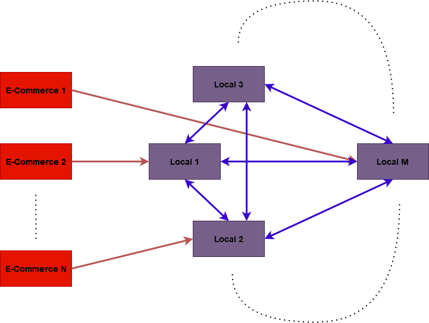
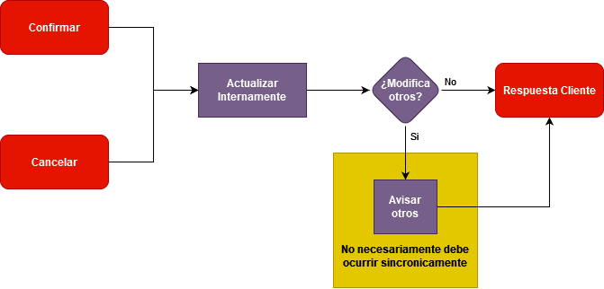

# Trabajo Práctico 2c2023 - Sistema de stocks

## Integrantes
- Tomás Apaldetti
- Mateo Craviotto

## Supuestos
Para la seleccion y el diseño del protocolo de concurrencia distribuida se asumio lo siguiente
- Utilizar recursos de otro nodo es la ultima opcion: Se toma con que cada local va a tratar de sastifacer los pedidos del e-commerce localmente, y si no puede tratara de usar stocks de otros nodos
- El bloqueo de recursos es conservador: Dado un pedido, una vez bloqueado ese stock se puede considerar como entregado hasta que se diga explicitamente lo contrario
- La cantidad de nodos es relativamente acotada: Esto es basado en que para vender se necesitan que los locales esten relativamente cerca.
- Agregar nuevos nodos a la red es relativamente raro: El proceso de agregar locales no ocurre mucho, incluso con perdidas de conexion

## Conexiones

### E-Commerce
Cada E-commerce estara conectado a un solo local. Mientras que un local tenga acceso a internet se considera que esta dentro de la red, por lo que tiene acceso completo a la red de manera indirecta.
En caso de que esta conexion se pierda, el e-commerce debera conectarse a otro local. La conexion a locales se realizara mediante una lista de direccion que proviene de otra parte (en este caso, desde la linea de comando)

### Locales
Cada local tendra dos `listeners` en puertos que seran provistos al inicio del programa.
Uno de ellos sera el encargado de escuchar y servir a los e-commerce con sus pedidos.
El otro sera el encargado de escuchar y conectarse con otros nodos de la red.

Al entrar un local en la red, este intentara conectarse con todos los otros nodos que posiblemente existan dentro de la red (lista de conexiones provistas de alguna manera, en este caso linea de comando). De esta manera, la red creara las conexiones a medida que cada nodo quiera entrar. Para identificar cada nodo dentro de la red, este debe tener un identificador unico. 

Una vez que un nodo entro en la red, este informara a los demas nodos la informacion de su stock, para que los otros conozcan el estado del mismo y puedan utilizar sus recursos. Una nodo se considera 'on-line' una vez compartio la informacion de sus recursos al menos una vez.

## Mensajes

### Mensajes para cliente
Para realizar cualquier modificacion de recursos, se utilizan transacciones en dos partes. En la primera se bloquea el stock, mientras que en la segunda se consume o se devuelve. De esta manera, la comunicacion con un cliente consta de cinco mensajes diferentes para la creacion, cancelacion o confirmacion de la misma.

1. Pedido(Productos)
1. PedidoOK(PedidoID)
2. PedidoNOK
3. Cancelar(PedidoID)
4. Confirmar(PedidoID)

De esta manera, el estado de una transaccion de cara al cliente puede ser:
- Error (Es decir, nunca se pudo relizar el pedido por falta de recursos u otro motivo)
- Confirmada
- Finalizada
- Cancelada

### Mensajes entre nodos
Una vez llega un pedido a un nodo, este intentara resolverlo con sus recursos locales primero. Como ultimo recurso, intentara cumplir con el pedido con otros nodos conectados. Para avisar que este stock fue utilizado, mandara mensajes a los otros nodos para preguntarles si es correcto utilizarlo. Cada nodo puede contestar de manera positiva o negativa. Si todos los nodos contestan de manera positiva, se toma como que se puede realizar la operacion y se contesta al cliente. Si algun nodo contesta de forma negativa, se avisa a los otros nodos que contestaron de forma positiva que se cancela esta operacion y se trata de realizar de nuevo la misma operacion, pero sin los nodos que contestaron negativamente (se asume que tengo informacion desactualizada). Esto se repite hasta que se pueda o no resolver el pedido.

Una vez un pedido fue confirmado, debido a la politica conservadora de reserva del stock, la confirmacion del pedido se puede realizar en un solo nodo, aunque la informacion se tiene que transmitir en algun momento. De la misma manera, aplica en el caso de que el pedido se cancele, solo que en este caso, en vez de consumir los recursos, cada nodo lo devuelve a sus recursos. 

## Detalles tecnicos

La tarea de servir un e-commerce solamente se encarga de eso. Por cada conexion nueva se crea una tarea que se encarga de servir con los pedidos que realiza un cliente. Esta tarea es puramente reactiva con respecto a los pedidos del cliente (es un cliente - servidor). 

De la misma manera ocurre en las conexiones de los nodos. La diferencia radica es que por cada nodo deben existir dos tareas debido a que la conexion es full-duplex. Es decir, existe una tarea de escritura y otra de lectura. Para saber si un mensaje es una respuesta a algo mandado anteriormente se utiliza un identificador unico por cada mensaje que amerite una respuesta. De esta manera, estas dos tareas de lectura y escritura se pueden unir entre si en caso de ser necesario. 

Toda la logica de modificacion de tiendas esta en manos de un actor. Este se encargara de armar los planes de pedidos, actualizar informacion de otras tiendas y todas las otras operaciones anteriormente nombradas.

La informacion de cada nodo se actualiza de forma periodica, para que las transacciones locales no desactualizen demasiado el estado de la red. Esta periodicidad puede basarse en diferentes metricas, pero en este caso simplemente se basa en tiempo que paso desde la anterior actualizacion. 

## Ejecución

### Locales

Para ejecutar un local o tienda (store) se utiliza el siguiente comando:

`cargo run --bin local -- --port-intern 12345 --extern-port 12312 --store-id 1 --node-ports 12346 12347 --ip 127.0.0.1`

- `port-intern` determina el puerto utilizado por este local para la red interna de tiendas/stores
- `extern-port` determina el puerto utilizado por este local para la comunicación con los ecommerce
- `store-id` es el identificador de la tienda que estamos ejecutando. Dene ser un entero no signado u64 que no hayamos asignado a otra tienda
- `node-ports` determina los puertos internos de los otros nodos (tiendas) que vayamos a ejecutar, separados por espacio
- `ip` es la dirección IP a la que se vincula el listener que escucha conexiones de los ecommerce. El valor por defecto es `127.0.0.1`

Lógicamente, los valores de estos parámetros se colocan a preferencia del usuario.

### Ecommerces

Para ejecutar un ecommerce se utiliza el siguiente comando:

`cargo run --bin ecommerce -- --ports 12312 12313 --ip 127.0.0.1`

- `ports` son los puertos externos de las tiendas a las que se conecta el ecommerce, separados por espacio
- `ip` es la dirección IP de las tiendas a las que se conecta el ecommerce

### Log level

Además, a ambos comandos se puede agregar el parámetro `--verbosity` que tiene las opciones *info*, *warning*, *error* o *debug* para establecer el nivel de loggeo de esa terminal. El valor por defecto es *info*.
